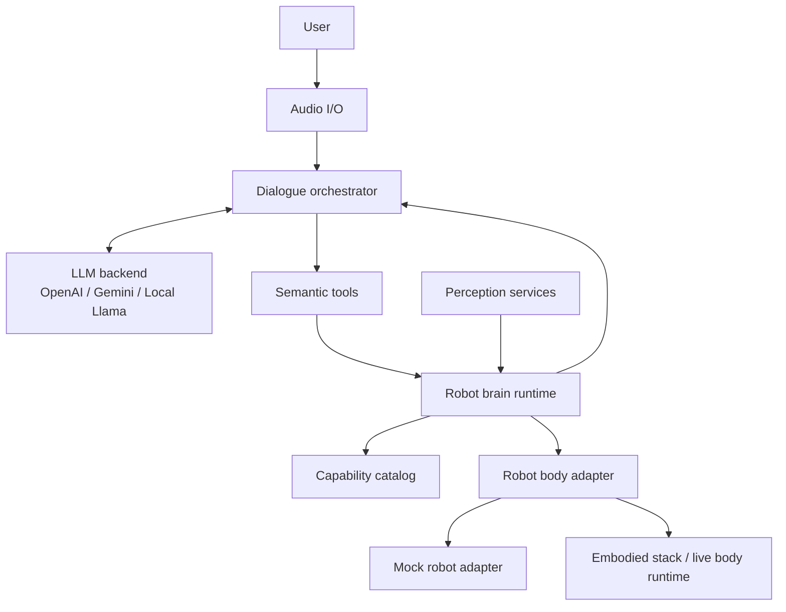
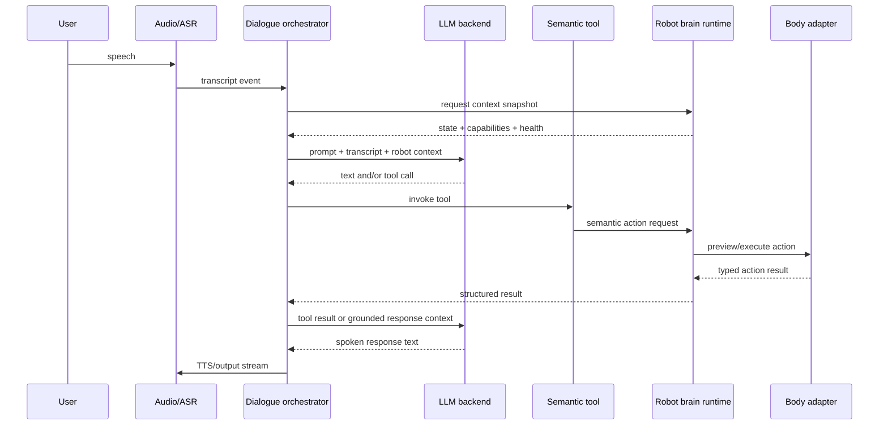

# Target architecture for a mock-first robot brain

## Design intent

Turn `reachy_mini_conversation_app` into a cleanly layered robot-brain application that can:

- run without hardware using a mock robot backend
- drive the real robot only through a semantic body interface
- keep dialogue, perception, and robot control decoupled
- preserve the current Reachy app path as a compatibility adapter
- integrate your Jushen/Feetech head through the existing embodied stack

---

## Architectural principles

1. **Semantic over raw**
   - The dialogue layer should request `perform_motif("guarded_close_right")`, not servo positions.
2. **Single hardware owner**
   - Only the body runtime may own live serial or vendor SDK connections.
3. **Mock-first**
   - Every new behavior must be runnable against a mock adapter before hardware integration.
4. **Capability-driven**
   - The brain should learn what the robot can do from a capability catalog, not from stale prompt text.
5. **Backend-neutral dialogue**
   - OpenAI/Gemini/local-Llama backends should plug into a shared orchestration layer.
6. **Action/result discipline**
   - All robot actions should have typed requests, typed results, IDs, status, warnings, and timestamps.

---

## Recommended package layout

```text
src/reachy_mini_conversation_app/
├── dialogue/
│   ├── __init__.py
│   ├── backend.py
│   ├── events.py
│   └── orchestrator.py
├── robot_brain/
│   ├── __init__.py
│   ├── contracts.py
│   ├── runtime.py
│   ├── state_store.py
│   ├── capability_catalog.py
│   ├── action_router.py
│   └── adapters/
│       ├── __init__.py
│       ├── base.py
│       ├── mock_adapter.py
│       ├── reachy_adapter.py
│       └── embodied_stack_adapter.py
├── tools/
│   ├── core_tools.py                 # refactored to depend on robot_brain runtime
│   ├── observe_scene.py              # new semantic tool
│   ├── set_expression_state.py       # new semantic tool
│   ├── perform_motif.py              # new semantic tool
│   ├── orient_attention.py           # new semantic tool
│   ├── report_robot_status.py        # new semantic tool
│   ├── stop_behavior.py              # new semantic tool
│   └── ... legacy wrappers ...
└── ...
```

### Existing files that should become adapters or legacy shims

- `moves.py` -> implementation detail of `reachy_adapter.py`
- `camera_worker.py` -> split into camera provider + attention target producer
- `dance_emotion_moves.py` -> Reachy-only compatibility layer
- `tools/dance.py` and `tools/play_emotion.py` -> legacy/debug only, not default production tools

---

## High-level component diagram



---

## Process boundary recommendation

### Preferred production boundary

Keep the brain and body in separate processes.

- **Brain process**
  - this repo
  - dialogue
  - tool selection
  - capability-aware planning
  - narration
  - high-level state and perception orchestration

- **Body process**
  - your existing embodied stack
  - calibration
  - serial ownership
  - health polling
  - action compilation
  - servo protocol
  - neutral/arming/live-safety rules

This is the cleanest way to preserve the hardware-grounded work already done.

### Acceptable development boundary

For early local work, the body adapter may be in-process if it targets only `MockRobotAdapter`.

---

## Dialogue and command-processing flow



### Important rule

The LLM should **never** see or emit:

- servo IDs
- raw joint counts
- serial packet details
- calibration numbers
- vendor-specific transport parameters

Those remain internal to the body runtime.

---

## Proposed core contracts

### Capability catalog

The brain should load a capability catalog at startup and refresh it periodically or on mode change.

The catalog should include:

- supported structural units
- supported expressive units
- supported persistent states
- supported motifs
- action names accepted by the adapter
- execution modes supported (`mock`, `preview`, `live`)
- health gating rules
- optional warnings or degraded capabilities

For the real robot, this catalog should be sourced from the embodied stack rather than hard-coded. Your existing docs already describe a maintained grounded catalog and even an expression-catalog endpoint, so the integration should use that as the source of truth. fileciteturn0file0

### Action request types

Recommended first wave of action types:

- `GoNeutral`
- `OrientAttention`
- `SetAttentionMode`
- `ObserveScene`
- `SetPersistentState`
- `PerformMotif`
- `StopBehavior`
- `QueryHealth`
- `QueryCapabilities`

### Action result fields

Every action result should carry:

- `action_id`
- `action_type`
- `status`
- `mode` (`mock`, `preview`, `live`)
- `started_at`, `finished_at`
- `summary`
- `warnings`
- `health_snapshot`
- `state_snapshot`
- optional `artifacts` or `observation`

---

## Recommended adapters

## 1. `MockRobotAdapter`

This is the default adapter for development.

It should:

- implement the full body interface
- keep an in-memory robot state
- support deterministic action execution
- optionally inject delays, warnings, and failures
- write an action journal to `runtime/mock_robot/actions.jsonl`
- expose a synthetic capability catalog
- return fake but plausible health data

Use this adapter for nearly all development until semantic behavior is stable.

## 2. `ReachyAdapter`

This adapter preserves current repo functionality during migration.

It should wrap the current:

- `ReachyMini`
- `MovementManager`
- `CameraWorker`
- `HeadWobbler`

The purpose is not to freeze Reachy as the architecture. The purpose is to let you refactor toward the target architecture without breaking the current app.

## 3. `EmbodiedStackAdapter`

This is the real target adapter for your robot.

It should talk to the existing body runtime through a typed client boundary.

### Strong recommendation

Do **not** port the serial driver into this repo.

Instead, the adapter should call into the embodied stack through one of:

- HTTP/REST
- local Python service boundary
- gRPC
- a small command/event IPC layer

### Required methods

At minimum, the adapter should support:

- `get_capabilities()`
- `get_state()`
- `get_health()`
- `preview_action(action)`
- `execute_action(action)`
- `cancel_action(action_id)`
- `go_neutral()`

---

## Perception design

### Current issue

`camera_worker.py` mixes:

- frame acquisition
- head tracking
- kinematic target calculation
- motion offsets

### Refactor target

Split perception into two responsibilities:

1. **sensing**
   - latest frame
   - detections
   - tracked targets
   - scene observations

2. **attention suggestion**
   - produces normalized targets such as:
     - image point
     - face target
     - person present / absent
     - confidence
   - does not directly drive actuators

The body adapter or robot-brain runtime decides whether to convert those suggestions into actuation.

---

## Semantic tool set for production

Replace the default Reachy tool set with a semantic one.

### Recommended default tools

- `observe_scene`
- `report_robot_status`
- `orient_attention`
- `set_attention_mode`
- `set_expression_state`
- `perform_motif`
- `stop_behavior`
- `go_neutral`

### Legacy/debug-only tools

Keep these only behind a debug or Reachy-legacy profile:

- `dance`
- `play_emotion`
- `move_head`
- `head_tracking`

---

## Prompt and capability integration

The prompt layer should stop hard-coding robot behavior descriptions like “the head can move left/right/up/down/front.”

Instead, at session start the dialogue layer should inject a concise capability summary derived from the live catalog, for example:

- persistent states available
- motifs available
- attention modes available
- whether live motion is enabled or preview/mock only
- current health limitations or degraded families

That makes the model’s action vocabulary match the robot’s actual grounded capabilities.

---

## Mock/simulation layer

## Why mock mode is essential

Your stated development constraint is exactly right: you should not require a physical robot during initial development.

The mock layer should let you validate:

- tool invocation
- intent-to-action mapping
- action arbitration
- grounding of assistant replies in action results
- failure handling
- cancellation
- scenario tests
- prompt/capability alignment

### Mock-mode behaviors to simulate

- neutral, thinking, listening, friendly, safe_idle states
- motifs such as guarded-close left/right
- attention modes
- observation requests
- degraded health or unavailable capabilities
- long-running actions and cancellations

---

## Safety model

### Modes

Use an explicit execution mode:

- `mock`
- `preview`
- `live`

### Live-mode requirements

The adapter should reject `live` mode unless:

- live hardware is enabled in config
- body runtime reports healthy enough state
- arm/lease preconditions are satisfied
- capability catalog was successfully loaded
- the action passes validation

### Recovery behavior

Any failed live action should have a defined recovery path:

- cancel running action
- optionally go neutral
- report degraded condition
- disable further live execution if health drops below threshold

This is especially important because the real head documentation already shows transport noise, voltage warnings, and family-specific fragility in neck and eye-area motion. fileciteturn0file0turn0file1turn0file2

---

## Implementation strategy

### First milestone

Get the app running with:

- `ROBOT_BACKEND=mock`
- semantic tools only
- capability-aware prompt injection
- scenario tests
- no hardware

### Second milestone

Preserve Reachy behavior through `ReachyAdapter`.

### Third milestone

Integrate `EmbodiedStackAdapter` in preview mode only.

### Fourth milestone

Enable live mode behind explicit gating and operator controls.

---

## What not to do

- Do not thread Jushen serial calls through tool functions.
- Do not expose raw joint or servo actions to the LLM.
- Do not rebuild calibration and live safety inside the conversation app.
- Do not make perception code write directly into low-level motion structures.
- Do not let production profiles auto-load arbitrary external Python tools.
