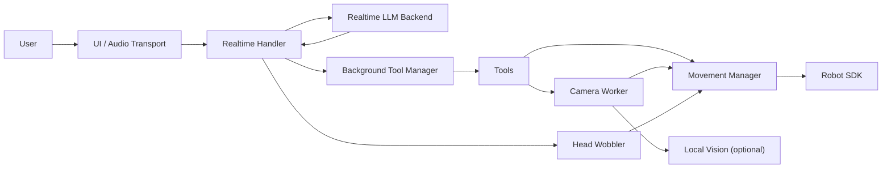

# How To Build A Similar Robot Conversation App

This project is a real-time voice app for a robot. It listens to microphone audio, streams that audio to a live LLM backend, lets the model call tools, turns tool results back into conversation context, and drives robot motion, camera use, and expressive behavior in parallel.

If you want to build something similar yourself, the main idea is:

1. Keep conversation, robot control, and vision as separate layers.
2. Let the LLM talk to your robot only through explicit tools.
3. Make one component the sole owner of robot motion commands.
4. Run slow tool work in the background so the conversation loop stays responsive.
5. Treat personality and enabled tools as data, not hardcoded logic.

This tutorial explains how this repo does that and how to recreate the same architecture from scratch.

## Language Support Note

If you build a similar project with a fully local backend, separate these three language questions:

1. Can the LLM understand and answer the language?
2. Can speech-to-text transcribe that language?
3. Can text-to-speech speak that language naturally?

In this project's current local macOS setup:

- `qwen3.5:9b` can generally handle Chinese text well.
- The default whisper.cpp model in the local setup is `ggml-base.en.bin`, which is English-only.
- That means typed Chinese can work, but spoken Chinese will usually transcribe poorly until you switch to a multilingual Whisper model.
- Chinese speech output also depends on whether macOS has a Chinese `say` voice installed.

If you want proper Chinese voice support in a similar project, the clean first step is to swap the STT model from `ggml-base.en.bin` to a multilingual model such as `ggml-base.bin`.

## 1. What This Project Actually Contains

At a high level, the repo is made of these subsystems:

- `src/reachy_mini_conversation_app/main.py`
  - Wires everything together.
  - Connects to the robot.
  - Chooses OpenAI Realtime or Gemini Live.
  - Chooses Gradio UI or headless console mode.
- `src/reachy_mini_conversation_app/openai_realtime.py`
  - Real-time OpenAI audio handler.
  - Streams audio in and out.
  - Handles transcripts, tool calls, idle behavior, and tool results.
- `src/reachy_mini_conversation_app/gemini_live.py`
  - Same overall job as the OpenAI handler, but for Gemini Live.
- `src/reachy_mini_conversation_app/tools/`
  - Tool interface, tool registry, built-in tools, and background task manager.
- `src/reachy_mini_conversation_app/moves.py`
  - Central motion controller.
  - Owns the control loop and is the only layer that should continuously command the robot pose.
- `src/reachy_mini_conversation_app/camera_worker.py`
  - Captures frames and optionally computes face-tracking offsets.
- `src/reachy_mini_conversation_app/vision/`
  - Optional local vision model and head-tracking backends.
- `src/reachy_mini_conversation_app/audio/`
  - Converts generated speech audio into small motion offsets so the robot looks alive while speaking.
- `profiles/`
  - Personalities. Each profile contains prompt text and an allow-list of tools.
- `src/reachy_mini_conversation_app/console.py`
  - Headless audio loop plus a tiny settings web UI for API keys and personalities.
- `src/reachy_mini_conversation_app/gradio_personality.py`
  - Personality controls for the Gradio version.

## 2. The Architectural Pattern

The most important design choice in this repo is separation of responsibility.



### Why this separation matters

- The realtime handler should manage conversation state, not robot kinematics.
- Tools should express intent like "look left" or "inspect camera", not own the control loop.
- The motion manager should be the single writer to the robot target pose.
- Camera and vision should run independently of the LLM connection.
- UI should be swappable without rewriting the robot logic.

That separation is what makes the app maintainable.

## 3. End-To-End Runtime Flow

When the app starts:

1. `main.py` parses CLI flags from `utils.py`.
2. It creates `ReachyMini`.
3. It initializes optional camera, local vision, and head tracking.
4. It creates `MovementManager`.
5. It creates `HeadWobbler`.
6. It packs those shared objects into `ToolDependencies`.
7. It chooses either:
   - `OpenaiRealtimeHandler`, or
   - `GeminiLiveHandler`
8. It chooses either:
   - Gradio mode with `fastrtc.Stream`, or
   - headless mode with `LocalStream`
9. It starts side threads:
   - movement manager
   - head wobbler
   - camera worker if enabled
10. It launches the audio stream.

During a conversation:

1. Microphone audio goes into the realtime handler.
2. The backend transcribes and generates speech.
3. Speech audio comes back in chunks.
4. The handler:
   - pushes the audio to playback
   - sends the same audio chunks to `HeadWobbler`
   - emits transcript updates to the UI
5. If the model decides to call a tool:
   - the handler receives the function call
   - the background tool manager starts that tool asynchronously
   - when the tool finishes, the handler injects the result back into the live conversation
6. If the user stops talking for long enough:
   - the handler sends an idle prompt that forces tool-only behavior
   - the robot may dance, emote, look around, or stay idle

## 4. The Key Idea: One Motion Owner

If you copy only one design rule from this repo, copy this one:

> Only one subsystem should continuously issue robot pose commands.

In this project, that subsystem is `MovementManager` in `moves.py`.

It owns:

- the primary move queue
- idle breathing
- speech-induced offsets
- face-tracking offsets
- listening state
- the final `set_target(...)` call to the robot

Tools do **not** directly run their own continuous motion loops. They usually queue a move or change a state that the movement manager consumes.

### Primary vs secondary motion

This project splits motion into two categories:

- Primary motion
  - dances
  - emotions
  - goto/look motions
  - breathing
- Secondary motion
  - audio wobble while speaking
  - face tracking offsets

That is a strong pattern. It lets you combine "dance" with "speech sway" or "neutral pose" with "head tracking" without each system fighting the others.

In this repo:

- primary moves are queued `Move` objects
- secondary motion is represented as pose offsets
- the movement manager fuses them before commanding the robot

## 5. The Conversation Layer

### OpenAI handler

`openai_realtime.py` is the clearest reference implementation.

It does five jobs:

1. Start a realtime session with:
   - instructions from the selected profile
   - selected voice
   - tool specs
2. Send microphone audio upstream in `receive(...)`
3. Consume server events in `_run_realtime_session(...)`
4. Emit playback audio or UI updates in `emit(...)`
5. Send completed tool results back into the conversation

Important details worth copying:

- The handler subclasses `fastrtc.AsyncStreamHandler`.
- It keeps a dedicated `output_queue`.
- It serializes `response.create()` calls with `_response_sender_loop()` because only one active response is allowed at a time.
- It debounces partial user transcripts before showing them.
- It treats tool execution as asynchronous work, not inline work.
- It injects camera images back into the live conversation when needed.

### Gemini handler

`gemini_live.py` mirrors the same architecture:

- same shared dependencies
- same tool abstraction
- same background tool manager
- same audio stream pattern

The main extra work is schema conversion because Gemini expects slightly different function declaration shapes.

That is another good pattern:

> Keep a backend-agnostic app architecture and swap only the transport adapter.

## 6. The Tool System

The tool system is the main bridge between the LLM and the robot.

### Tool interface

In `tools/core_tools.py`, every tool inherits from a simple abstract base:

```python
class Tool(abc.ABC):
    name: str
    description: str
    parameters_schema: Dict[str, Any]

    def spec(self) -> Dict[str, Any]:
        return {
            "type": "function",
            "name": self.name,
            "description": self.description,
            "parameters": self.parameters_schema,
        }

    @abc.abstractmethod
    async def __call__(self, deps: ToolDependencies, **kwargs: Any) -> Dict[str, Any]:
        ...
```

This is exactly the level of abstraction you want.

The tool receives:

- validated-ish JSON arguments from the model
- a `ToolDependencies` object with access to the robot, movement manager, camera worker, and vision processor

### Dynamic loading

This repo does not hardcode a single global tool list.

Instead, `_load_profile_tools()` loads tools from:

- `profiles/<name>/tools.txt`
- built-in shared tools in `src/.../tools/`
- optional profile-local Python files
- optional external tool directories

That means personality selection controls both:

- what the robot is told to be
- what the robot is allowed to do

That is a strong design decision. It keeps behavior and permissions aligned.

### Built-in tools

The built-in tools are intentionally small:

- `move_head`
- `camera`
- `head_tracking`
- `dance`
- `stop_dance`
- `play_emotion`
- `stop_emotion`
- `do_nothing`
- system tools: `task_status`, `task_cancel`

Notice how each tool is thin:

- `move_head` queues a `GotoQueueMove`
- `dance` queues a dance move
- `head_tracking` toggles a camera-worker flag
- `camera` returns either:
  - a local vision answer, or
  - a base64 JPEG for the live model to inspect

That thin-tool pattern is worth keeping.

## 7. Background Tool Execution

The realtime session must stay responsive. If a tool blocks for too long, speech and UI responsiveness degrade.

This repo solves that with `BackgroundToolManager`.

Its job:

- start tool tasks asynchronously
- track status and progress
- cancel tools
- notify the handler on completion

This is important because the LLM tool-calling lifecycle is not the same as the robot action lifecycle.

Example:

- the model says "use camera"
- the tool starts
- the conversation loop keeps running
- when the tool finishes, the handler sends a `function_call_output`
- the model then decides what to say next

That decoupling is the right shape for any robot assistant with slow tools.

## 8. Vision And Camera

This project supports two vision modes.

### Mode A: Remote vision via the live model

This is the default when the `camera` tool runs and `--local-vision` is not enabled.

Flow:

1. `CameraWorker` stores the latest frame.
2. `camera` tool encodes that frame as JPEG.
3. The tool returns `{"b64_im": ...}`.
4. The realtime handler injects the image into the conversation as an input image.
5. The model answers using the image.

This is a clean pattern if you already trust the cloud model for vision.

### Mode B: Local vision

If `--local-vision` is enabled:

1. `initialize_camera_and_vision()` loads `VisionProcessor`.
2. The `camera` tool sends the frame and question to the local VLM.
3. The tool returns a textual description instead of an image blob.

This pattern is useful when:

- you want lower privacy risk for images
- you want to reduce round trips for simple image questions
- you want a cloud model for speech but local vision for camera content

### Head tracking

`CameraWorker` also optionally computes face-tracking offsets.

Key design choices:

- camera capture runs in its own thread
- latest frame is buffered
- tracking is just another source of secondary pose offsets
- if tracking is lost, offsets interpolate back to neutral smoothly

This is exactly the right way to integrate reactive vision into a motion system.

## 9. Audio-Reactive Motion

`audio/head_wobbler.py` and `audio/speech_tapper.py` make the robot move while speaking.

The pipeline is:

1. TTS audio chunks arrive from the live model.
2. `HeadWobbler.feed()` decodes the audio.
3. `SwayRollRT` computes low-amplitude pitch, yaw, roll, x, y, z oscillations.
4. Those oscillations become secondary offsets.
5. `MovementManager` blends them into the final commanded pose.

This is an excellent feature to copy because it makes a robot feel responsive without requiring any extra model reasoning.

Also note the separation:

- the LLM does not decide these tiny offsets
- the audio-reactive motion layer derives them automatically from sound

That is exactly what you want for expressive behavior.

## 10. Personality, Prompts, And Profiles

This repo treats "personality" as a filesystem concept.

A profile can contain:

- `instructions.txt`
- `tools.txt`
- `voice.txt`
- optional custom tool Python files

Examples live in `profiles/`.

### Prompt composition

`prompts.py` supports include syntax like:

```text
[identities/witty_identity]
[passion_for_lobster_jokes]
```

Those placeholders expand to files under `src/reachy_mini_conversation_app/prompts/`.

That is a very good pattern if you want:

- reusable identity fragments
- reusable behavior fragments
- small, composable prompt modules

### Why profiles are useful

Profiles solve several problems at once:

- prompt management
- voice selection
- tool permissions
- custom behavior packs

If you build a similar project, do not hardcode personalities in Python.
Put them on disk.

## 11. UI Strategy

This app supports two frontends.

### Gradio mode

In `main.py`, the Gradio path:

- creates a chat UI
- mounts a `fastrtc.Stream`
- passes personality controls as extra inputs
- shows transcripts and tool usage

### Headless mode

In `console.py`, the headless path:

- uses the robot's own media recorder/player
- runs async record and playback loops
- exposes a tiny settings web UI for API keys and profiles

This is a smart split:

- Gradio is good for development and simulation
- headless mode is good for deployment on or near the robot

If you build your own version, keep the conversation core UI-agnostic and attach multiple frontends.

## 12. What Is Reachy-Specific And What Is Generic

You do not need a Reachy Mini to reuse this architecture.

### Generic parts you can copy almost directly

- realtime handler abstraction
- background tool manager
- profile-driven tool loading
- prompt includes
- thin tool interface
- camera worker pattern
- one-owner motion controller
- audio-reactive motion layer

### Reachy-specific parts you will replace

- `ReachyMini`
- `set_target(...)`
- `look_at_image(...)`
- `get_current_head_pose()`
- dance/emotion libraries
- robot media recorder/player
- Reachy pose conventions

If your robot SDK is different, make a thin adapter so the rest of the app does not care.

## 13. A Good Reimplementation Plan

Do not rebuild the full repo at once. Build it in layers.

### Phase 1: Minimal talking robot

Implement:

- robot adapter
- realtime handler
- audio input/output
- one simple prompt
- no tools
- no camera
- no motion besides neutral playback

Goal: speak with the robot in real time.

### Phase 2: Tool calling

Add:

- `Tool` base class
- tool registry
- `ToolDependencies`
- one tool like `move_head`

Goal: the model can trigger a visible action.

### Phase 3: Real motion manager

Add:

- move queue
- one control loop thread
- one final robot command sink
- interpolated goto moves

Goal: actions no longer fight each other.

### Phase 4: Camera and vision

Add:

- camera worker
- frame buffer
- `camera` tool
- local or remote image analysis

Goal: environment-aware conversation.

### Phase 5: Expressiveness

Add:

- head wobble from speech
- idle behaviors
- breathing
- face tracking

Goal: the robot feels alive even when the model is not explicitly commanding every movement.

### Phase 6: Profiles

Add:

- prompt files
- tool allow-lists
- voice selection
- external tool loading

Goal: behavior becomes configurable without code edits.

## 14. Recommended Minimal File Layout For Your Own Version

If you want to build a smaller clone, start with something like this:

```text
my_robot_app/
  pyproject.toml
  .env.example
  src/my_robot_app/
    main.py
    config.py
    prompts.py
    handler.py
    console.py
    robot_adapter.py
    motion.py
    camera_worker.py
    tools/
      core.py
      move_head.py
      camera.py
    profiles/
      default/
        instructions.txt
        tools.txt
```

Only after that works should you add:

- `audio/`
- `vision/`
- Gradio UI
- external profile/tool loading
- personality editor

## 15. Pseudocode For The Core Contracts

Here is the simplest version of the architecture you should implement.

### Shared dependencies

```python
@dataclass
class ToolDependencies:
    robot: RobotAdapter
    movement: MovementManager
    camera_worker: CameraWorker | None = None
    vision: VisionProcessor | None = None
```

### Tool interface

```python
class Tool(ABC):
    name: str
    description: str
    parameters_schema: dict[str, Any]

    @abstractmethod
    async def __call__(self, deps: ToolDependencies, **kwargs: Any) -> dict[str, Any]:
        ...
```

### Motion owner

```python
class MovementManager:
    def queue_move(self, move: Move) -> None: ...
    def set_speech_offsets(self, offsets: PoseOffsets) -> None: ...
    def set_listening(self, listening: bool) -> None: ...
    def start(self) -> None: ...
    def stop(self) -> None: ...
```

### Realtime handler

```python
class ConversationHandler(AsyncStreamHandler):
    async def start_up(self) -> None: ...
    async def receive(self, frame) -> None: ...
    async def emit(self): ...
    async def shutdown(self) -> None: ...
```

If your own project preserves those four contracts, the rest of the system will stay manageable.

## 16. The Development Order I Would Use

If I were rebuilding this repo from zero, I would do it in this order:

1. Create a robot adapter with:
   - get camera frame
   - play audio
   - record audio
   - set target pose
2. Make a headless conversation loop that can:
   - record mic audio
   - send to realtime backend
   - play returned audio
3. Add profile-based prompt loading.
4. Add the tool interface and one tiny tool.
5. Add a movement manager and route all motion through it.
6. Add camera buffering and the `camera` tool.
7. Add background tool execution.
8. Add idle behavior.
9. Add head wobble and face tracking.
10. Add Gradio or another richer UI.

That order gives you working software early and keeps complexity under control.

## 17. Common Mistakes This Repo Avoids

### Mistake: letting every tool command the robot directly

Why it is bad:

- motions conflict
- behavior becomes jittery
- you cannot blend tracking and speech motion cleanly

What this repo does instead:

- one movement manager owns the final command

### Mistake: executing tools inline inside the websocket event loop

Why it is bad:

- voice latency spikes
- playback stutters
- transcripts lag

What this repo does instead:

- background tool manager

### Mistake: tying personalities to Python code

Why it is bad:

- prompt iteration becomes slow
- non-programmers cannot edit behavior

What this repo does instead:

- `profiles/<name>/instructions.txt`
- `profiles/<name>/tools.txt`
- optional `voice.txt`

### Mistake: coupling UI to robot logic

Why it is bad:

- you cannot reuse the core app in simulation, headless deployment, or a different frontend

What this repo does instead:

- common handler and dependencies
- separate Gradio and console frontends

## 18. Use This Repo As A Reference Map

When reading the code, I recommend this order:

1. `src/reachy_mini_conversation_app/main.py`
2. `src/reachy_mini_conversation_app/utils.py`
3. `src/reachy_mini_conversation_app/openai_realtime.py`
4. `src/reachy_mini_conversation_app/tools/core_tools.py`
5. `src/reachy_mini_conversation_app/tools/background_tool_manager.py`
6. `src/reachy_mini_conversation_app/moves.py`
7. `src/reachy_mini_conversation_app/camera_worker.py`
8. `src/reachy_mini_conversation_app/vision/local_vision.py`
9. `profiles/example/`

That reading order matches the real dependency flow.

## 19. Final Takeaway

The project is not "just a robot chat app". It is a layered system with:

- a real-time speech transport
- a configurable prompt/profile layer
- a tool-calling execution layer
- a background task layer
- a single-owner motion layer
- optional camera and vision layers
- separate frontend choices

If you recreate those layers in that order, you can build a very similar project for Reachy Mini or for a different robot.

The most reusable blueprint is:

> realtime handler + thin tools + background execution + single motion owner + profile-driven behavior

That is the architecture to copy.
